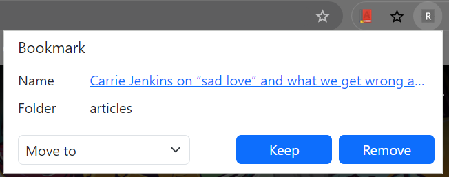

Use it as you see fit - 
* To organize links in your bookmarks folder by either removing or moving them to a relevant folder
* To navigate conveniently through the bookmarked links in say a recipes-like folder

Usage -
* Clone this repository.
* Load this directory in Chrome as an [unpacked extension](https://developer.chrome.com/docs/extensions/get-started/tutorial/hello-world#load-unpacked).
* Pin the extension to the taskbar and open up the popup by clicking the action button.
* Select the bookmarks folder by right clicking on the extension and choosing options
* Select the bookmarks folder from the dropdown and save it
* Get going

In action -
